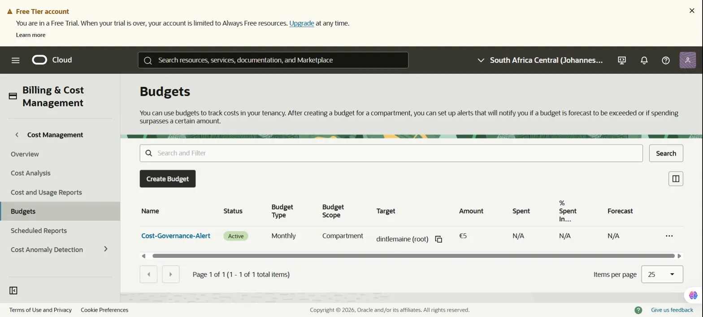
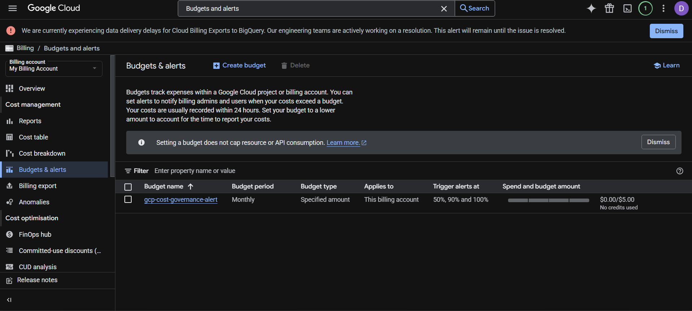

# OCI Cost Governance and Billing Alert System

## Live Project
Built and configured on Oracle Cloud Infrastructure (OCI) - South Africa Central Region (Johannesburg)

## What This Is
A real-time cloud cost monitoring and governance system deployed on Oracle Cloud Infrastructure.
This project demonstrates understanding of enterprise cloud financial management,
a core responsibility in any professional cloud environment.

## The Business Problem This Solves
Uncontrolled cloud spending is one of the biggest risks organisations face when
adopting cloud infrastructure. Without proper monitoring, a company can accumulate
unexpected costs that damage budgets and erode trust in cloud adoption.
This system solves that problem by providing automated alerts before spending gets out of control.

## What I Built
- A monthly budget configured in OCI Billing and Cost Management
- An automated alert rule triggered at 80% of the monthly budget threshold
- Email notifications sent to the account owner when the threshold is reached
- Applied to the root compartment to monitor all OCI resource spending

## Technologies Used
- Oracle Cloud Infrastructure (OCI) Billing and Cost Management
- OCI Budgets service
- OCI Alert Rules and Notifications
- IAM Compartment structure

## Why This Matters for Enterprise Cloud
In enterprise environments, cloud engineers are responsible for more than just
deploying infrastructure. They are accountable for cost efficiency and governance.
This project demonstrates that I understand cloud from a business perspective,
not just a technical one. Oracle ACE professionals work directly with clients
on cost optimisation and this project reflects that mindset.

## Architecture
Budget Scope: Root Compartment (all OCI resources)
Budget Amount: 5 EUR per month
Alert Threshold: 80% of budget (Actual Spend)
Notification Method: Automated email alert
Reset Period: Monthly

## Screenshot

## Author
Dintle Maine, BCom Information Systems and Management, University of the Witwatersrand 2025
GitHub: github.com/dintlemaine-png

## GCP Budget Alert Screenshot

## Multi-Cloud Comparison
| Feature | OCI | GCP |
|---|---|---|
| Budget Amount | €5 per month | $5 per month |
| Alert Thresholds | 80% actual spend | 50%, 90%, 100% actual spend |
| Notification Method | Email | Email to billing admins |
| Region | South Africa Central, Johannesburg | Global |
| Reset Period | Monthly | Monthly |

## Key Insight
GCP provides three automatic threshold alerts compared to OCI's single 
configurable threshold. Both platforms provide robust cost governance 
capabilities suitable for enterprise cloud environments.
